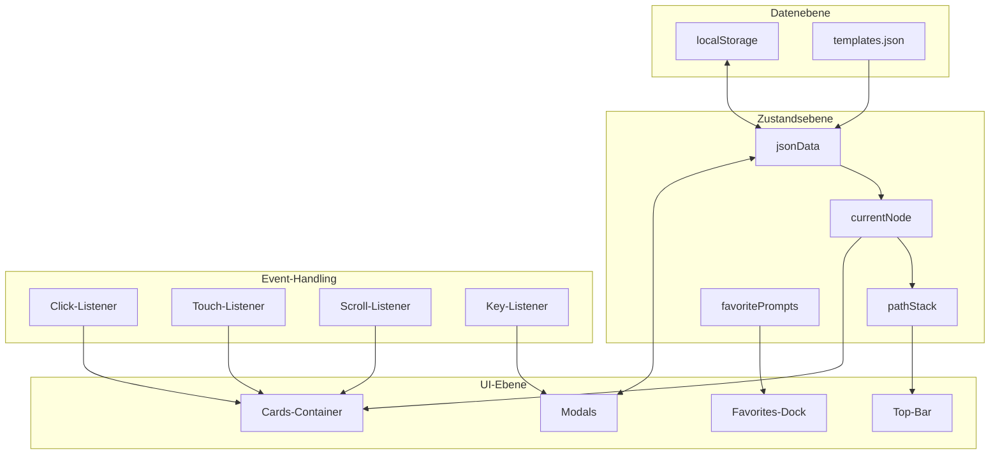

# Vollständige Code-Analyse: Prompt-Templates Browser

**Analyse-Datum:** 2026-02-14  
**Analysierte Dateien:** `index.html`, `style.css`, `script.js`

---

## Inhaltsverzeichnis

1. [Architektur & Struktur](#1-architektur--struktur)
2. [UI/UX Design](#2-uiux-design)
3. [Animationen & Effekte](#3-animationen--effekte)
4. [Performance-Aspekte](#4-performance-aspekte)
5. [Verbesserungspotenzial](#5-verbesserungspotenzial)

---

## 1. Architektur & Struktur

### 1.1 Gesamtarchitektur

Die Anwendung folgt einer **Single-Page Application (SPA)** Architektur ohne Framework-Einsatz. Die Struktur ist bewusst minimalistisch gehalten:

```
AITemplates-main/
|-- index.html        (241 Zeilen)  - HTML-Struktur
|-- style.css         (1240 Zeilen) - Styling & Animationen
|-- script.js         (2612 Zeilen) - Anwendungslogik
|-- templates.json    (Fallback-Daten)
|-- manifest.json     (PWA-Konfiguration)
|-- icons/            (App-Icons)
```

### 1.2 HTML-Struktur ([`index.html`](index.html))

Die HTML-Datei ist semantisch strukturiert und enthält:

#### Hauptkomponenten:
| Komponente | ID/Class | Funktion |
|------------|----------|----------|
| Aurora-Container | `#aurora-container` | Hintergrund-Animation mit 3 Formen |
| Top-Bar | `#top-bar` | Navigation, Breadcrumb, Aktions-Buttons |
| Cards-Container | `#cards-container` | Hauptbereich für Kartenanzeige |
| Prompt-Modal | `#prompt-modal` | Detailansicht für Prompts |
| Create-Folder-Modal | `#create-folder-modal` | Ordner-Erstellung |
| Move-Item-Modal | `#move-item-modal` | Element verschieben |
| Fixed-Back-Button | `#fixed-back` | Zurück-Navigation |
| Notification-Area | `#notification-area` | Toast-Benachrichtigungen |
| Favorites-Dock | `#favorites-dock` | Favoriten-Schnellzugriff |

#### SVG-Templates (versteckt):
- `#svg-template-folder` - Ordner-Icon
- `#svg-template-expand` - Expand-Icon
- `#svg-template-copy` - Copy-Icon
- `#svg-template-checkmark` - Checkmark-Icon
- `#svg-template-delete` - Delete-Icon
- `#svg-template-edit` - Edit-Icon
- `#svg-template-move` - Move-Icon

#### Externe Bibliotheken (CDN):
```html
<!-- Zeile 234-237 -->
<script src="https://cdnjs.cloudflare.com/ajax/libs/vivus/0.4.6/vivus.min.js"></script>
<script src="https://cdn.jsdelivr.net/npm/sortablejs@latest/Sortable.min.js"></script>
<script src="https://cdnjs.cloudflare.com/ajax/libs/gsap/3.12.5/gsap.min.js"></script>
<script src="https://cdnjs.cloudflare.com/ajax/libs/gsap/3.12.5/Flip.min.js"></script>
```

### 1.3 JavaScript-Architektur ([`script.js`](script.js))

#### Globale Zustandsvariablen (Zeile 1-71):
```javascript
// Kernzustand
let jsonData = null;           // Baumstruktur der Templates
let currentNode = null;        // Aktuell angezeigter Knoten
let pathStack = [];            // Navigationspfad
let favoritePrompts = [];      // Array von Prompt-IDs

// DOM-Referenzen (werden in initApp() initialisiert)
let modalEl, breadcrumbEl, containerEl, promptFullTextEl, ...

// Observer & Animation-Handles
let favoritesChipResizeObserver = null;
let favoritesLayoutRaf = null;
let favoritesHeightSyncRaf = null;
```

#### Datenstruktur:
```javascript
// Knoten-Struktur
{
  id: "uuid-string",
  type: "folder" | "prompt",
  title: "Anzeigename",
  items: [...],      // nur bei Ordnern
  content: "..."     // nur bei Prompts
}
```

#### Hauptfunktionen nach Kategorie:

**Navigation:**
| Funktion | Zeile | Beschreibung |
|----------|-------|--------------|
| [`navigateToHome()`](script.js:629) | 629-646 | Zurück zur Root-Ebene |
| [`navigateOneLevelUp()`](script.js:1034) | 1034-1051 | Eine Ebene nach oben |
| [`navigateToNode()`](script.js:1622) | 1622-1641 | Zu spezifischem Knoten |
| [`performViewTransition()`](script.js:1304) | 1304-1314 | View Transitions API Wrapper |

**Rendering:**
| Funktion | Zeile | Beschreibung |
|----------|-------|--------------|
| [`renderView()`](script.js:1529) | 1529-1620 | Hauptrendering-Funktion |
| [`updateBreadcrumb()`](script.js:1643) | 1643-1724 | Breadcrumb-Update |
| [`renderFavoritesDock()`](script.js:2480) | 2480-2606 | Favoriten-Dock rendern |

**Datenmanagement:**
| Funktion | Zeile | Beschreibung |
|----------|-------|--------------|
| [`loadJsonData()`](script.js:1428) | 1428-1457 | Daten laden |
| [`persistJsonData()`](script.js:1963) | 1963-1976 | In localStorage speichern |
| [`findNodeById()`](script.js:1350) | 1350-1361 | Knoten suchen |
| [`findParentOfNode()`](script.js:1053) | 1053-1066 | Elternknoten finden |

**Modal-Management:**
| Funktion | Zeile | Beschreibung |
|----------|-------|--------------|
| [`openModal()`](script.js:1823) | 1823-1831 | Modal öffnen |
| [`closeModal()`](script.js:1833) | 1833-1874 | Modal schließen |
| [`openPromptModal()`](script.js:1743) | 1743-1758 | Prompt-Modal öffnen |

**Favoriten:**
| Funktion | Zeile | Beschreibung |
|----------|-------|--------------|
| [`toggleFavoriteStatus()`](script.js:2181) | 2181-2196 | Favoriten-Status toggeln |
| [`loadFavorites()`](script.js:2165) | 2165-2175 | Favoriten laden |
| [`saveFavorites()`](script.js:2177) | 2177-2179 | Favoriten speichern |

### 1.4 Architektur-Diagramm



---

## 2. UI/UX Design

### 2.1 Glassmorphism-Ästhetik

Die Anwendung verwendet eine konsequente Glassmorphism-Designsprache mit folgenden CSS-Variablen:

#### Farbvariablen ([`style.css:7-52`](style.css:7)):
```css
:root {
  /* Hintergrundfarben */
  --bg-0: hsl(228, 12%, 8%);    /* Dunkelster Hintergrund */
  --bg-1: hsl(228, 12%, 12%);   /* Sekundärer Hintergrund */
  
  /* Vordergrundfarben */
  --fg-1: hsl(220, 20%, 95%);  /* Haupttext */
  --fg-2: hsl(220, 15%, 75%);  /* Sekundärtext */
  --fg-3: hsl(220, 12%, 60%);  /* Tertiärtext */
  
  /* Akzentfarben */
  --acc-1: #8b5cf6;            /* Lila */
  --acc-2: #00e6ff;            /* Cyan */
  
  /* Glassmorphism-Effekte */
  --glass-bg: rgba(28, 32, 46, 0.6);
  --glass-stroke: rgba(255, 255, 255, 0.1);
  --glass-stroke-hover: rgba(0, 230, 255, 0.7);
  --blur: 20px;
  
  /* Glass-Gradienten */
  --glass-highlight: radial-gradient(150% 120% at 30% 10%, rgba(255,255,255,0.3), rgba(255,255,255,0) 80%);
  --glass-shadow-overlay: radial-gradient(150% 120% at 70% 90%, rgba(0,0,0,0.4), rgba(0,0,0,0) 80%);
  --glass-border-gradient: linear-gradient(130deg, var(--acc-2) 0%, var(--acc-1) 100%);
}
```

#### Aktionsfarben:
```css
--favorite-color: #ffca7a;     /* Gold */
--delete-color: #ff5555;       /* Rot */
--edit-color: #50fa7b;         /* Grün */
--move-color: #ffb86c;         /* Orange */
```

### 2.2 UI-Komponenten

#### Karten (Cards):
```css
/* style.css:317-366 */
.card {
  /* Glassmorphism-Basis */
  background: var(--glass-highlight), var(--glass-shadow-overlay), var(--glass-bg);
  backdrop-filter: blur(var(--blur)) saturate(200%);
  
  /* Layout */
  aspect-ratio: 1 / 0.7;
  width: min(100%, var(--card-max-width));
  
  /* Animation-Basis */
  opacity: 0;
  transform: translateY(20px) scale(0.98) translateZ(0);
  will-change: transform, opacity, box-shadow, backdrop-filter;
}

.card.is-visible {
  opacity: 1;
  transform: translateY(0) scale(1) translateZ(0);
}
```

#### Buttons:
```css
/* style.css:440-467 */
.btn {
  background: rgba(255,255,255,0.08);
  border: 1px solid rgba(255,255,255,0.15);
  border-radius: 999px;  /* Pill-Shape */
  transition: transform var(--duration-1) var(--ease-smooth);
}

.btn-primary {
  background: linear-gradient(135deg, var(--acc-2), var(--acc-1));
  border: none;
}

.btn-ghost {
  background: transparent;
  border-color: transparent;
}
```

#### Favoriten-Dock:
```css
/* style.css:668-1157 */
.favorites-dock {
  position: fixed;
  bottom: 0;
  backdrop-filter: blur(calc(var(--blur) * 0.9)) saturate(210%);
  
  /* Variablen für dynamische Anpassung */
  --favorite-chip-width: clamp(148px, 20vw, 224px);
  --favorite-chip-base-height: clamp(56px, 11vw, 88px);
}
```

### 2.3 Responsives Verhalten

#### Breakpoints:
| Breakpoint | Änderung |
|------------|----------|
| `> 1320px` | Standard-Kartengröße |
| `1320px` | `--card-min-width: clamp(200px, 28vw, 232px)` |
| `1120px` | `--card-min-width: clamp(192px, 32vw, 228px)` |
| `900px` | `--card-min-width: clamp(184px, 40vw, 220px)` |
| `720px` | `grid-template-columns: repeat(3, 1fr)` |
| `640px` | Favoriten-Dock Anpassungen |
| `480px` | Weitere Mobile-Optimierungen |

#### Safe-Area-Unterstützung:
```css
/* style.css:48-51 */
--safe-area-inset-top: env(safe-area-inset-top, 0px);
--safe-area-inset-right: env(safe-area-inset-right, 0px);
--safe-area-inset-bottom: env(safe-area-inset-bottom, 0px);
--safe-area-inset-left: env(safe-area-inset-left, 0px);
```

### 2.4 Layout-Integrität

Die Anwendung verwendet mehrere Mechanismen zur Sicherstellung der Layout-Integrität:

1. **Dynamische Schriftgrößenanpassung** ([`adjustCardTitleFontSize()`](script.js:1459)):
   - Iterative Anpassung bis Text in Container passt
   - Berücksichtigung von Zeilenanzahl und verfügbarer Höhe

2. **CSS-Variablen für Kartengrößen**:
   ```css
   --card-min-width: clamp(208px, 22vw, 236px);
   --card-max-width: clamp(228px, 24vw, 252px);
   ```

3. **Text-Overflow-Behandlung**:
   ```css
   /* style.css:405-420 */
   .card h3 {
     overflow-wrap: anywhere;
     word-break: break-word;
     hyphens: auto;
     text-wrap: pretty;
   }
   ```

---

## 3. Animationen & Effekte

### 3.1 CSS-Animationen

#### Keyframe-Animationen:

| Animation | Zeile | Verwendung |
|-----------|-------|------------|
| `jiggle` | 362-366 | Organize-Mode Wackeln |
| `copy-success-anim` | 571-575 | Kopier-Bestätigung |
| `favorite-chip-enter` | 1068-1081 | Favoriten-Chip Einblenden |
| `favorites-toggle-peek` | 1083-1093 | Toggle-Icon Animation |
| `favorites-toggle-peek-expanded` | 1095-1105 | Toggle-Icon expanded |
| `fade-in-vt` | 1174 | View Transition |
| `fade-out-vt` | 1175 | View Transition |
| `slide-from-right-vt` | 1176 | View Transition Forward |
| `slide-to-left-vt` | 1177 | View Transition Forward |
| `slide-from-left-vt` | 1178 | View Transition Backward |
| `slide-to-right-vt` | 1179 | View Transition Backward |

#### Aurora-Animation:
```css
/* style.css:108-139 */
.aurora-shape {
  position: absolute;
  border-radius: 50%;
  opacity: 0.26;
  transform: translate3d(0, 0, 0);
  transition: transform 0.8s var(--ease-smooth), opacity 0.8s var(--ease-smooth);
}

.shape1 { width: 52vmax; height: 52vmax; top: -18vmax; left: -18vmax; }
.shape2 { width: 46vmax; height: 46vmax; top: 12vmax; right: -14vmax; }
.shape3 { width: 44vmax; height: 44vmax; bottom: -8vmax; left: 18vmax; }
```

### 3.2 JavaScript-Animationen

#### Vivus.js (SVG-Animation):
```javascript
// script.js:1378-1412
function setupVivusAnimation(parentElement, svgId) {
    const vivusInstance = new Vivus(svgId, { 
        type: 'delayed', 
        duration: 100, 
        start: 'manual' 
    });
    
    // Hover-Triggered Animation
    parentElement.addEventListener('mouseenter', () => playAnimation(false));
    parentElement.addEventListener('mouseleave', () => finishAnimation());
}
```

#### GSAP Flip-Plugin:
```javascript
// script.js:297-407
function setFavoritesExpanded(shouldExpand) {
    // Flip-State für Positionen
    let flipState = window.Flip.getState(chips);
    
    // Layout-Änderung
    favoritesDockEl.classList.toggle('expanded', expanded);
    
    // Flip-Animation
    window.Flip.from(flipState, {
        duration: 0.9,
        ease: 'power3.inOut',
        stagger: { each: 0.016, from: 'center' }
    });
}
```

#### Parallax-Effekt:
```javascript
// script.js:780-794
function updateParallax() {
    const parallaxFactor = 0.3;
    const targetOffset = lastScrollY * parallaxFactor;
    auroraContainerEl.style.transform = `translate3d(0, ${targetOffset}px, 0)`;
}
```

### 3.3 View Transitions API

```javascript
// script.js:1304-1314
function performViewTransition(updateDomFunction, direction) {
    if (!document.startViewTransition) {
        updateDomFunction();
        return;
    }
    document.documentElement.dataset.pageTransitionDirection = direction;
    const transition = document.startViewTransition(updateDomFunction);
    transition.finished.finally(() => {
        delete document.documentElement.dataset.pageTransitionDirection;
    });
}
```

```css
/* style.css:1181-1200 */
::view-transition-old(root),
::view-transition-new(root) {
  animation-duration: var(--transition-duration-page);
  animation-timing-function: var(--ease-smooth);
}

html[data-page-transition-direction="forward"]::view-transition-old(root) { 
    animation-name: slide-to-left-vt; 
}
html[data-page-transition-direction="forward"]::view-transition-new(root) { 
    animation-name: slide-from-right-vt; 
}
```

### 3.4 GPU-Beschleunigung

#### Verwendete Techniken:

| Technik | Verwendung | Zeile |
|---------|------------|-------|
| `translate3d()` | Aurora-Shapes | CSS:113 |
| `translateZ(0)` | Cards, Modals, Top-Bar | CSS:164, 338, 518 |
| `will-change` | Cards, Aurora, Notifications | CSS:104, 339, 611 |
| `transform` | Alle Animationen | Durchgängig |

```css
/* Beispiel: Card GPU-Beschleunigung */
.card {
  transform: translateY(20px) scale(0.98) translateZ(0);
  will-change: transform, opacity, box-shadow, backdrop-filter;
}
```

---

## 4. Performance-Aspekte

### 4.1 DOM-Manipulation

#### Rendering-Begrenzung:
```javascript
// script.js:1539-1540
const maxItems = 36; 
const nodesToRender = childNodes.slice(0, maxItems);
```

#### DocumentFragment-Nutzung:
```javascript
// script.js:2534
const fragment = document.createDocumentFragment();
// ... Elemente erstellen ...
favoritesListEl.appendChild(fragment);
```

### 4.2 Event-Throttling

#### Scroll-Throttling:
```javascript
// script.js:763-775
containerEl.addEventListener('scroll', () => {
    lastScrollY = containerEl.scrollTop;
    if (!ticking) {
        window.requestAnimationFrame(() => {
            updateParallax();
            ticking = false;
        });
        ticking = true;
    }
});
```

#### Resize-Throttling:
```javascript
// script.js:2206-2216
function handleWindowResize() {
    if (resizeRafId) {
        cancelAnimationFrame(resizeRafId);
    }
    resizeRafId = requestAnimationFrame(() => {
        updateDockPositioning();
        requestFavoritesLayoutFrame();
        document.querySelectorAll('.card').forEach(adjustCardTitleFontSize);
        resizeRafId = null;
    });
}
```

### 4.3 Passive Event-Listener

```javascript
// script.js:738-750
favoritesDockEl.addEventListener('touchstart', handleFavoritesTouchStart, { passive: true });
favoritesDockEl.addEventListener('touchmove', handleFavoritesTouchMove, { passive: true });
favoritesDockEl.addEventListener('touchend', handleFavoritesTouchEnd, { passive: true });
favoritesScrollAreaEl.addEventListener('wheel', handleFavoritesWheel, { passive: false });
favoritesScrollAreaEl.addEventListener('scroll', handleFavoritesScroll, { passive: true });
```

### 4.4 localStorage-Persistenz

```javascript
// script.js:1963-1976
function persistJsonData(successMsg, type) {
    try {
        const jsonString = JSON.stringify(jsonData, null, 2);
        localStorage.setItem(localStorageKey, jsonString);
        showNotification(successMsg, type);
        downloadBtn.style.display = 'inline-flex';
        resetBtn.style.display = 'inline-flex';
    } catch (e) {
        console.error("Fehler beim Speichern im Local Storage:", e);
        showNotification('Speichern fehlgeschlagen!', 'error');
    }
}
```

### 4.5 ResizeObserver

```javascript
// script.js:617-627
function getFavoriteChipObserver() {
    if (typeof ResizeObserver === 'undefined') return null;
    if (!favoritesChipResizeObserver) {
        favoritesChipResizeObserver = new ResizeObserver(() => {
            requestFavoritesLayoutFrame();
        });
    }
    return favoritesChipResizeObserver;
}
```

### 4.6 Motion-Preference-Handling

```javascript
// script.js:797-834
function setupMotionPreferenceHandling() {
    motionMediaQuery = window.matchMedia('(prefers-reduced-motion: reduce)');
    motionPreferenceChangeHandler = () => {
        prefersReducedMotion = motionMediaQuery.matches;
        auroraContainerEl.classList.toggle('motion-reduced', prefersReducedMotion);
    };
    motionPreferenceChangeHandler();
    motionMediaQuery.addEventListener('change', motionPreferenceChangeHandler);
}
```

```css
/* style.css:1229-1240 */
@media (prefers-reduced-motion: reduce) {
  *, *::before, *::after {
    animation-duration: 0.01ms !important;
    transition-duration: 0.01ms !important;
    scroll-behavior: auto !important;
  }
}
```

---

## 5. Verbesserungspotenzial

### 5.1 Design-Verbesserungen

#### Farbschema-Erweiterungen:
| Bereich | Aktuell | Verbesserungsvorschlag |
|---------|---------|------------------------|
| Akzentfarben | 2 Hauptfarben | Erweiterung auf semantische Farben für verschiedene Zustände |
| Kontrast | Teilweise niedrig | Erhöhung für bessere Barrierefreiheit (WCAG AA) |
| Dunkelmodus | Nur ein Modus | Optionaler Hell/Dunkel-Modus Toggle |

#### UI-Komponenten:
| Komponente | Verbesserung |
|------------|--------------|
| Karten | Skeleton-Loading für flüssigere Übergänge |
| Modals | Swipe-to-close auf Mobile |
| Favoriten-Dock | Drag-and-Drop zum Neuordnen |
| Breadcrumb | Overflow-Ellipsis mit Dropdown |

### 5.2 Animationsoptimierungen

#### GPU-Beschleunigung:
| Element | Aktuell | Optimierung |
|---------|---------|-------------|
| Aurora | `will-change: transform` | Delegierung an CSS `contain: strict` |
| Cards | `will-change` auf allen | Nur bei Interaktion aktivieren |
| Favoriten | GSAP Flip | CSS-Container-Queries für Layout |

#### Neue Animationen:
```css
/* Vorschlag: Micro-Interactions */
.card:active {
    transform: scale(0.98);
    transition: transform 50ms ease-out;
}

/* Vorschlag: Staggered Entry */
.cards-container .card:nth-child(1) { animation-delay: 0ms; }
.cards-container .card:nth-child(2) { animation-delay: 30ms; }
/* ... */
```

### 5.3 Performance-Verbesserungen

#### Code-Splitting (ohne Build):
```javascript
// Vorschlag: Lazy Loading für seltene Funktionen
async function openMoveItemModal(itemId) {
    if (!window.moveItemModule) {
        window.moveItemModule = await import('./modules/move-item.js');
    }
    window.moveItemModule.init(itemId);
}
```

#### Virtual Scrolling:
```javascript
// Vorschlag: Für große Ordner
// Aktuell: max 36 Items
// Verbesserung: Virtual Scrolling für beliebig viele Items
```

#### Caching:
```javascript
// Vorschlag: Template-Caching
const templateCache = new Map();
function getCardTemplate(type) {
    if (!templateCache.has(type)) {
        templateCache.set(type, createTemplate(type));
    }
    return templateCache.get(type).cloneNode(true);
}
```

### 5.4 Barrierefreiheit

| Bereich | Aktuell | Verbesserung |
|---------|---------|--------------|
| Tastatur-Navigation | Teilweise | Vollständige Fokus-Indikatoren |
| Screen-Reader | ARIA vorhanden | Erweiterte Live-Regions |
| Kontrast | --fg-3: 60% | Erhöhung auf 70% für WCAG AA |
| Touch-Targets | Teilweise < 44px | Einheitliche 44px Mindestgröße |

### 5.5 Code-Struktur

#### Modularisierung:
```javascript
// Vorschlag: Trennung in Module
// modules/
//   |-- navigation.js
//   |-- rendering.js
//   |-- favorites.js
//   |-- modals.js
//   |-- storage.js
```

#### Event-Delegation:
```javascript
// Aktuell: Einzelne Listener
// Verbesserung: Zentrale Event-Delegation
document.addEventListener('click', (e) => {
    const action = e.target.closest('[data-action]');
    if (action) handleAction(action.dataset.action, e);
});
```

---

## Zusammenfassung

### Stärken:
- Konsistente Glassmorphism-Ästhetik
- Performante Vanilla-JS-Architektur
- Umfassende GPU-Beschleunigung
- View Transitions API Integration
- Responsive Design mit Safe-Area-Support
- Motion-Preference-Respekt

### Verbesserungsbereiche:
- Barrierefreiheit (Kontrast, Touch-Targets)
- Code-Modularisierung
- Erweiterte Animationen (Micro-Interactions)
- Virtual Scrolling für große Datenmengen
- Optionaler Hell-Modus

---

*Dieses Dokument dient als Grundlage für nachfolgende Optimierungen und Erweiterungen.*